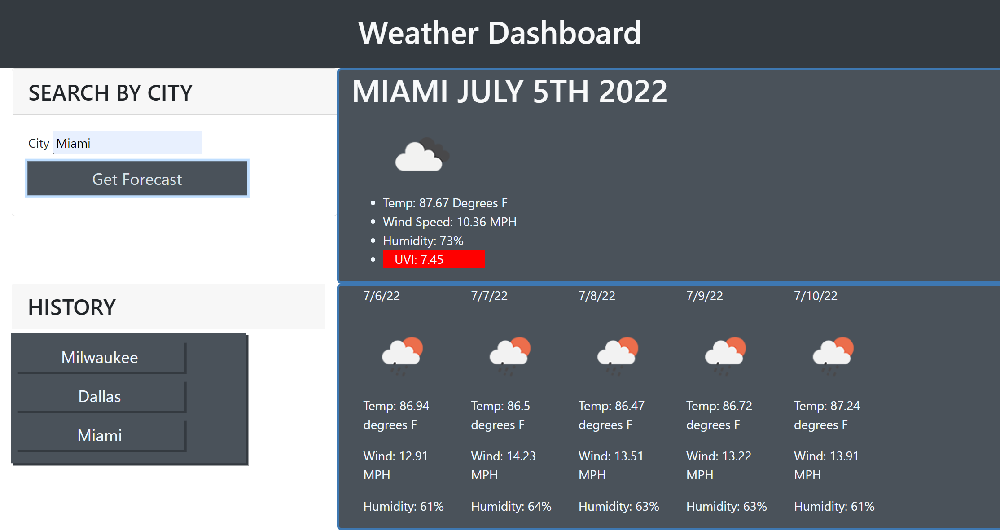

# weather-man

## Installation
No installation is required. Website's full functionality is available through the web browser.

## Usage
User can get the current weather and a 5-day forecast by searching the name of the city in the form. Every city searched creates a button in the history window below the form that can be clicked to navigate through previous cities' forecasts. History is saved to local storage so users can return to the site daily and click through the cities they save in their history.

## Credits
I worked with a number of fellow students to work through some of the challenges of the assignment. Sam, Sarah, Bryan, Ocean, and Camille.
My tutor was also a great help working through some of the functionality.

